# Estación meteorológica autónoma LoRaWAN
Estación metereológica DIY con comunicaciones LoRaWAN utilizando la red TTN Community.

## Montaje
### Material utilizado
- Hemos utilizado la [placa Heltec HTCC-AB01](https://es.aliexpress.com/item/1005001288501966.html) para la banda ISM europea de 868MHz que tiene las siguientes características:
  - Compatible con Arduino, por tanto compatible en Windows, Mac OS y Linux
  - Configurable a través de comandos AT
  - Chip CP2102 de puerto serie a USB integrado
  - Basada en ASR605x (ASR6501, ASR6502) , esos chips ya están integrados el PSoC ®  4000 serie MCU (ARM® cortex® M0 + Core) y SX1262;
  - Soporte de la especificación LoRaWAN 1.0.2
  - Diseño de energía ultra bajo, solo 3.5uA en Deep Sleep. Para este tipo de proyecto, el consumo son muy importantes y aquí tenemos es tabla que ayudará a dimensionar la batería y el panel solar:
   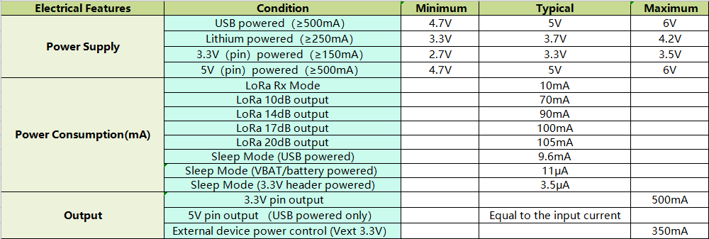
  - Sistema de gestión de energía solar incluido, se puede conectar directamente con un panel solar de 5-7 V
  - Conector SH1.25-2 para baterías incluido, sistema de administración de batería integrado (administración de carga y descarga, protección de sobrecarga, detección de energía de la batería, conmutación automática de energía de batería / USB)
  - Interfaz micro USB con protección ESD (Electrostatic Discharge), protección contra cortocircuitos, blindaje RF y otras medidas de protección
  - Buena correspondencia de impedancia y larga distancia de comunicación
  - Certificación CE y FCC

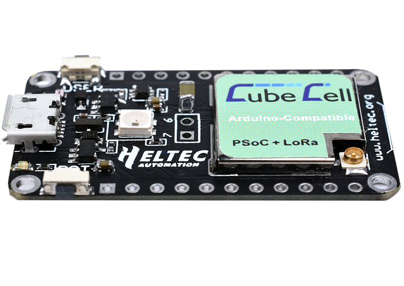

Podremos encontrar toda la documentación de esta placa en: [Documentos y ficheros](https://resource.heltec.cn/download/CubeCell), [FAQs](https://github.com/HelTecAutomation/HeltecDocs/blob/master/en/source/cubecell/frequently_asked_questions.md) 

- [Batería de polímero de litio de 3,7V y conector JST SH1.0 de 1,0mm y dos pines](https://es.aliexpress.com/item/4000288987647.html)

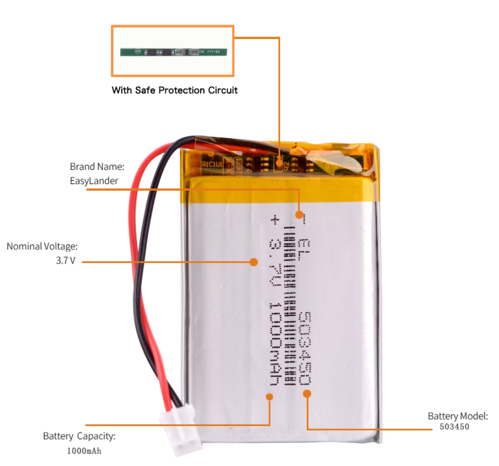

- [Panel solar de 6V](https://es.aliexpress.com/item/4001128543657.html)

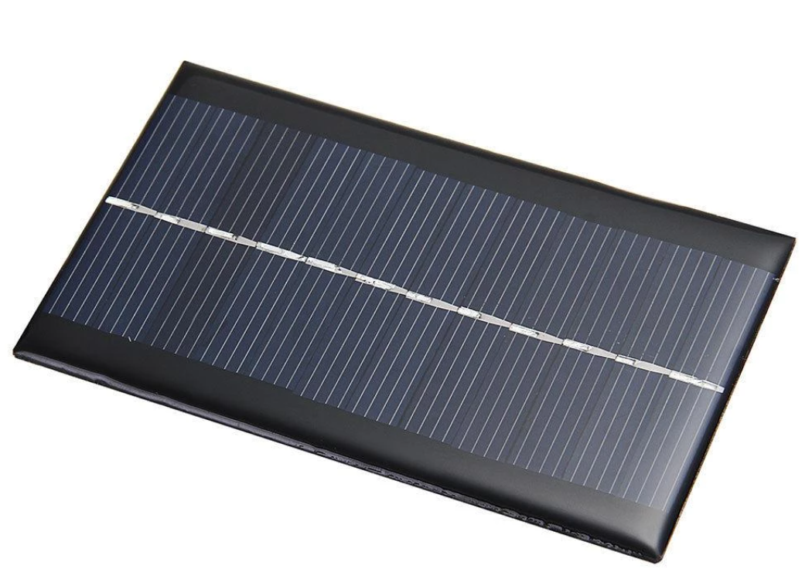

- [Anemómetro WH-SP-WS01](https://www.amazon.es/Acfthepiey-WH-SP-WS01-Instrumento-velocidad-Meteorol%C3%B3gico/dp/B0C9Z6P5NY/ref=sr_1_1?__mk_es_ES=%C3%85M%C3%85%C5%BD%C3%95%C3%91&crid=3NNWOSQLM3LY2&keywords=WH-SP-WS01&qid=1698012410&s=tools&sprefix=wh-sp-ws01%2Cdiy%2C113&sr=1-1)

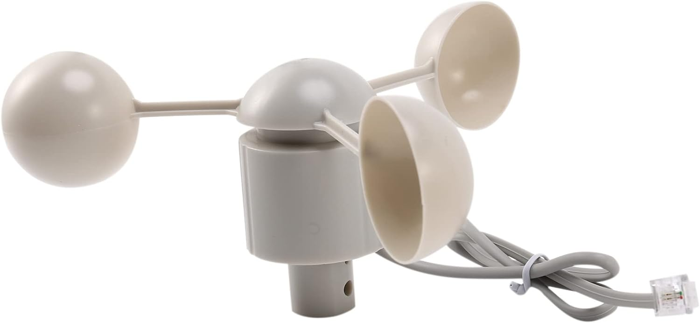

- Sensor de temperatura y humedad DHT22 (3-Pin).
  - [via Aliexpress](https://www.aliexpress.com/wholesale?catId=0&initiative_id=SB_20220806101441&SearchText=dht22)
 
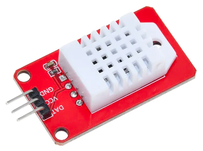

- [Carcasa hermética IP66](https://es.aliexpress.com/item/33060319519.html)

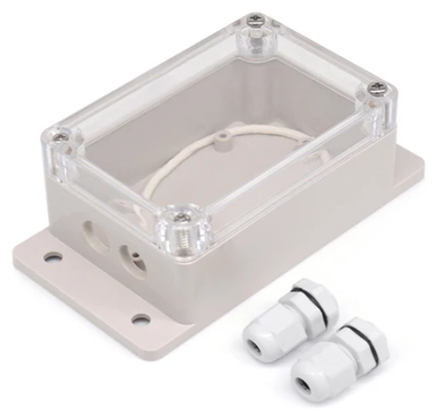

Por otra parte también se necesitarán otros componentes no electrónicos como cables, mini-protoboard...

## Conexionado

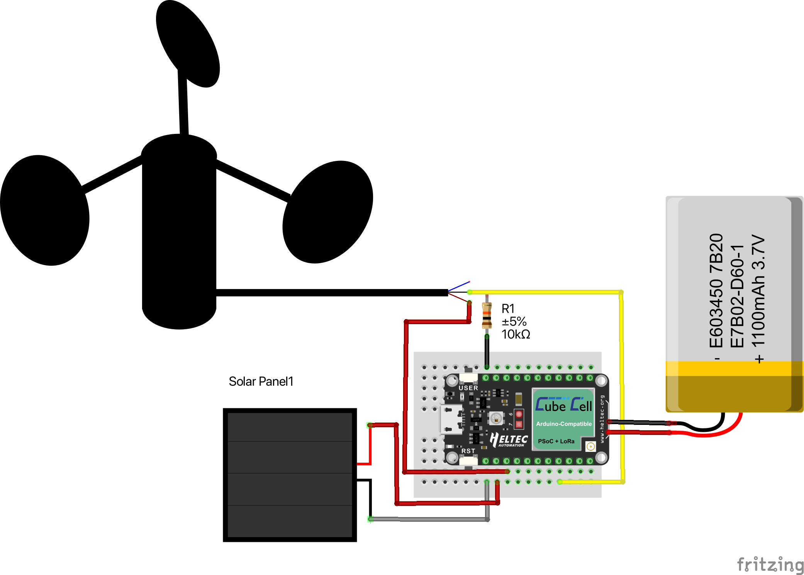

## Montaje paso a paso
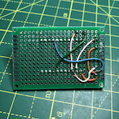
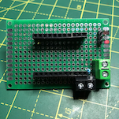
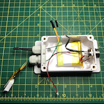
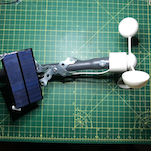
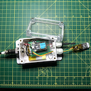

## Programación y configuración
### Configuración IDE Arduino
Lo para poder programar adecuadamente el dispositivo tendremos que configurar el entorno de programación de Arduino con las configuraciones de hardware y librerías de esta placa.
1. Añadir la URL https://github.com/HelTecAutomation/CubeCell-Arduino/releases/download/V1.5.0/package_CubeCell_index.json a Preferences->Settings->Additional boards:
2. Añadir la librería de CayenneLPP. **Importante: versión 1.1.0**:
3. 

4. Si aparece un aviso de instalar otras librerias con dependencias. Seleccionar opción de instalar todas:


4. Añadir la librería del sensor de temperatura y humedad: DHT sensor library de Adafruit.
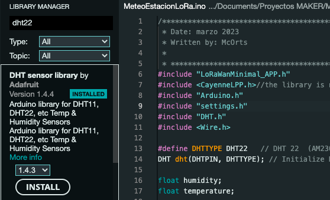

6. Seleccionar la tarjeta CubeCell HTCC-AB01 y configurar todos sus parámetros así:


### Subir el sketch de Arduino
Con el cable conectado seleccionamos el puerto USB que nuestro ordenador haya asignado. Una vez compilado y cargado en el dispositivo. Abrimos el monitor serie para comprobar que log de actividad del programa es correcto.

### Configuración del sensor en la nube (TTN)

Vamos a utilizar los servicios de The Things Network que es un servicio en la nube al que están conectados los _gateway_ libres de la las Comunidades TTN. 
La ruta de la información es la siguiente:
1. El sensor (_nodo_) transmite por radio con modulación LoRa el trama de datos que recibe el _gateway_
2. Este _gateway_ está conectado a internet para retransmitir la trama, hora como paquete de datos.
3. Los servidores de TTN decodifican el mensaje y ofrecen diferentes integraciones y _endpoints_ para que nuestras aplicaciones utilicen la información leída por los sensores.

Hay muchas variantes para implementar este enrutamiento. Para este se ha elegido estas configuraciones:
- Dispositivo es del tipo OTAA (Over-The-Air Activation) un dispositivo final realiza un procedimiento de identificación con una red LoRaWAN, durante el cual se asigna una _DevAddr_ dinámica a un dispositivo final y las claves raíz se utilizan para derivar claves de sesión. Por lo tanto, _DevAddr_ y las claves de sesión cambian a medida que se establece cada nueva sesión.
- Publicación del paquete de-codificado en una cola MQTT a la que nuestra aplicación está subscrita.


Estos son los pasos a seguir empezando por acceder a la aplicación _back-end_ de TTN en esta URL: https://console.cloud.thethings.network/ en la que seleccionaremos nuestra región y luego nos loguearemos con nuestro usuario registrado.

<br>
<br>
<br>
<br>
<br>
<br>
<br>

### Registro de la aplicación
En TTN los dispositivos (_devices_) iguales, se agrupan en una aplicación desde la cual serán registrados. por lo tanto, primero hay que añadir una aplicación:

En el formulario de alta de aplicación rellenaremos estos campos: 
- Para el _Application ID_, elige un identificador único, en minúsculas, puedes usar caracteres alfanuméricos peor no guiones ´-´ consecutivos.
- Para  _Description_, elige la descripción que prefieras.
- No hace falta poner nada en _Application EUI_ 
- Presiona _Create application_ para finalizar


<br>
<br>
<br>
<br>
<br>
<br>
<br>
<br>

Aparecerá ahora la página con la nueva aplicación añadida donde encontrarás un botón de _+ Add end device_ necesario para crear los dispositivos asociados. 


### Registro del dispositivo
En TTN un dispositivo (devide) representa la configuración de lo que también llama nodo (node) que a fin de cuentas es nuestro sensor. 
Al acceder al formulario de registro nos quedamos en la pestaña de _From The LoRaWAN Device Repository_ ya que estamos usando un microcontrolador conocido.
Ahora tenemos que seleccionar el tipo, modelo y marca de nuestro sensor tal y como aparece en la captura inferior. 


El la casilla inferior vemos que pide una clave de JoinEUI que normalmente nos la daría el fabricante. Pero en nuestro caso utilizaremos una sencilla aplicación web para generarla:  https://descartes.co.uk/CreateEUIKey.html


Lo siguiente será generar las _DevEUI_ y _AppKey_ pulsando los correspondientes iconos de la derecha para que se genere automáticamente.
Finalmente queda rellenar el _Device ID_ que será el nombre único de este nodo.


Finalmente pulsaremos _Register en device_ para que, seguidamente aparezca la pantalla con la configuración de nuestro nuevo nodo.Aquí podremos ver los datos de configuración y parámetros que necesitamos por ser un dispositivo de tipo ABP. Y que tendremos que pasar al fichero de configuración settings.h que se cargará en el _sketch_ del IDE de Arduino.


Para poder copiar las _keys_ en el formato "array" que se requiere en el fichero de configuración: "settings.h" 
Nota: hay que pulsar el icono <> de "_toggle array formating_" para tener el formato adecuado para este fichero.

```cpp
// LoRaWAN Configuration

/* OTAA para*/
static uint8_t devEui[] = { 0x70, 0xB3, 0xD5, 0x8E, 0xD0, 0x05, 0x99, 0xDA };
static uint8_t appEui[] = { 0x9A, 0xC4, 0x08, 0x90, 0xC8, 0x4F, 0xA4, 0x33 };
static uint8_t appKey[] = { 0x42, 0x0A, 0x60, 0x65, 0x83, 0x98, 0x75, 0x18, 0xEC, 0x46, 0xC7, 0x0A, 0x19, 0xD8, 0x21, 0x28 };

uint16_t userChannelsMask[6]={ 0x00FF,0x0000,0x0000,0x0000,0x0000,0x0000 };
static DeviceClass_t lorawanClass = LORAWAN_CLASS;

// Sensors params
#define AnemPort GPIO0  // Digital pin connected to the anemomether
volatile int TurnsPulses; // number of turns of the anemomether
#define DHTPIN GPIO3     // Digital pin connected to the DHT22 sensor

// Devise location
const float latitude = 39.573;
const float longitude = 2.732;
const int alt = 20;

// Other params
float SensorId= 10.01;// Sensor  identifcator number 
const int DutyCycle = 300000; // Transmision and reading period
```

### Formato de la trama

Desde el menú vertical izquierdo accederemos al _Payload Formatters_ y la opción Uplink para definir cómo decodificar la trama de datos de nuestro mensaje LoRa que hemos establecido en el firmware. En nuestro caso hemos usado la librería CayenneLPP y esto es lo que aquí tenemos de seleccionar como tipo:


De esta manera el mensaje MQTT que vamos a utilizar para leer los valores del sensor; será generado por backend de TTN en una estructura JSON perfectamente formateada que podemos encontrar en el código fuente en el fichero MeteoEstacionLoRa.ino:

```json
 // Cayenne
  lpp.reset();

  lpp.addTemperature(1, temperature);
  lpp.addRelativeHumidity(1, humidity);
  lpp.addDigitalInput(1,TurnsPulses); 
  lpp.addAnalogInput(1,getBatteryVoltage());
  lpp.addAnalogInput(2,SensorId);
  lpp.addAnalogInput(3,cycles);
  lpp.addGPS(2, latitude, longitude, alt);

```
Donde, además de lo odvio: temperatura, humedad, voltaje de la bateria y localización:
- TurnsPulses: son las vueltas que han dado las cazueletas del anemómetro en 300sg (DutyCycle de la configuración)
- SensorId: el código del identificador del sensor descrito en la configuración. (10.01 en el ejemplo).
- Cycles: es un contador de ciclos de conexión, sube hasta 50 y luego desciende hasta 1. De manera que si se representa en una gráfica, mostrará una sierra que tendrá escalones si hay pérdidas de paquetes.
  
### Integración MQTT
Por último necesitaremos las credenciales de acceso al broker MQTT que TTN nos ofrece como una opción de integración para poder suscribirnos a topic desde nuestra aplicación:


**IMPORTANTE**: copia el password ahora porque una vez cerrada esta ventana. No tendrás opción a consultarlo.

Resultado final
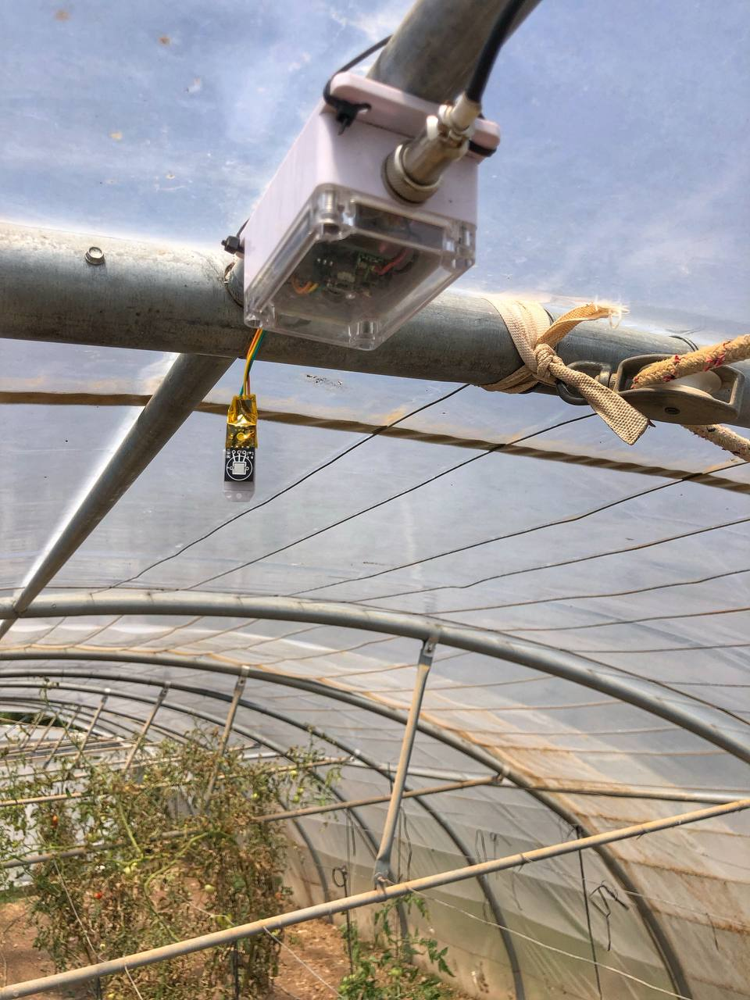
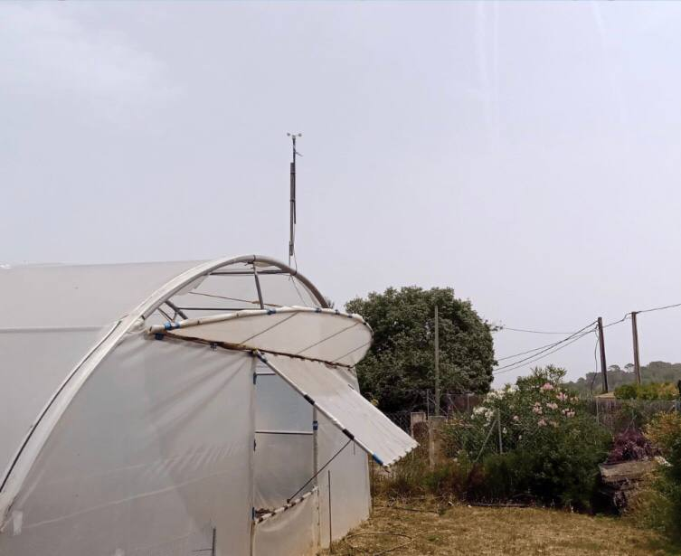

